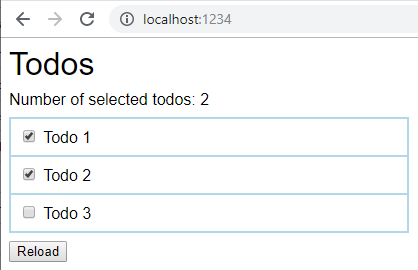
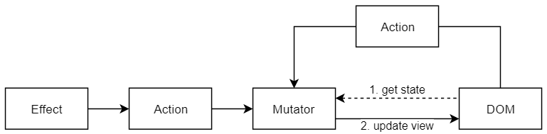
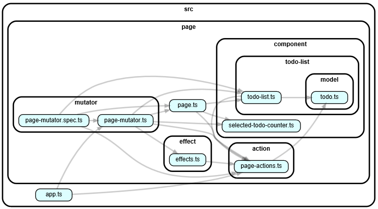

# dom-as-flux-like-store

## Background

I'm on the one hand fascinated by (and somehow convinced of ;-) the unidirectional flow idea of [Flux](https://facebook.github.io/flux/) like architectures (like [Redux](https://redux.js.org/), [Vuex](https://vuex.vuejs.org/guide/), [NgRx](https://ngrx.io/)).
But on the other hand frustrated by the whole complexity and potential vendor-lock in the used frameworks ([Anglular](https://angular.io/), [React](https://reactjs.org/), [Vue.js](https://vuejs.org/)) introduce.

This repository contains a simplistic todo demo application that uses an unidirectional flow but no explicit store.
Instead the DOM with its data attributes is used.



One big advantage of storing the state in the DOM is that server-side rendering with a template engine is possible.
There is no need of executing the JavaScript on the server-side.
Of course the server generated HTML must match the HTML created on the client.
That can for example be achieved by a templating engine like [handlebars](https://handlebarsjs.com/) that is available for JavaScript as well for Java ([Handlebars.java](https://github.com/jknack/handlebars.java)).

In terms of an approach to implement Flux without one of the big mentioned frameworks, there are some similarities with [jquery-flux-todo](https://github.com/talyssonoc/jquery-flux-todo).
But in jquery-flux-todo has not the focus on usig the DOM as the state store.

The todo demo application is a plain JavaScript application without any dependencies.
For triggering the actions custom DOM events (`CustomEvent` instances) are used.

At build time TypeScript is used with [Parcel](https://en.parceljs.org/) as bundler.
For unit testing [Jest](https://jestjs.io/) with its [jsdom](https://github.com/jsdom/jsdom) support is used.
For having an eye on the code dependencies [Dependency cruiser](https://github.com/sverweij/dependency-cruiser) is an awesome tool.

## Development

```
npm install
```

For a production build:
```
npm run build && npx http-server ./dist -p 1234
```

For a development server:
```
npm run start

```
In both cases the application is available via [http://127.0.0.1:1234/](http://127.0.0.1:1234/).

### Unit testing

The jsdom support of Jest allows to test the mutators.
The following code is from `page-mutator.spec.ts`:

```typescript
function prepareDom() {
    document.body.innerHTML = `
      <div id="${Page.SELECTED_TODO_COUNTER_ID}"></div>
      <div id="${Page.TODO_CONTAINER_ID}"></div>
      <button id="${Page.RELOAD_BUTTON_ID}">Reload</button>`;
      
    Page.init();
}

test('displayTodos', () => {
  prepareDom();

  pageReducer(displayTodos([{ id: 42, selected: false, text: 'test todo' }]));
  const todoSummary = TodoList.getTodoSummary(document.getElementById(Page.TODO_CONTAINER_ID)!);

  expect(todoSummary.length).toBe(1);
});
```

## Architecture

The architecture is a mix of many sources.
Partially it tends more towards Redux than Flux because of the mutators and no dispatcher.
They are actually reducers that read the state from the DOM and update the DOM then accordingly.
I called them mutator instead of reducer because with the mutable DOM the functional programming analogy did not match anymore.
But the concept of effects is borrowed from NgRx.
An example effect is used to simulate asynchronous loading of the todos.

Therefore the overall flow looks like that:



For debug purposes all actions are logged in the console.
A sample flow looks like that:
```
23:28:18.565 app.ts:9 action: {"type":"DOM_READY"}
23:28:23.702 app.ts:9 action: {"type":"TOGGLE_TODO","id":3}
23:28:24.565 app.ts:9 action: {"type":"TOGGLE_TODO","id":2}
23:28:25.332 app.ts:9 action: {"type":"RELOAD_TODOS"}
23:28:27.335 app.ts:9 action: {"type":"DISPLAY_TODOS","todos":[{"id":1,"text":"Todo 1","selected":true},{"id":2,"text":"Todo 2","selected":true},{"id":3,"text":"Todo 3","selected":false}]}
23:28:29.141 app.ts:9 action: {"type":"TOGGLE_TODO","id":2}
```

One important aspect of every architectural pattern are the code dependencies.
The pattern only works out if there are no cycles.



## Summary

The approach looks interesting. 
It allows applications with no dependencies which might be maintainable for a long time without relaying on a framework.
It might be a way to deal with complex business logic.

But using the DOM definitively does not provide the advantage of immutable state and time travel debugging like Redux.
It also does not fully address the original Flux idea to have more real data instead of derived data.
The data stored in the DOM is of course very close to display concerns.

An option to simplify unit testing could be an function like `createDOMMap(...)` described in [How to create a map of DOM nodes with vanilla JS](https://gomakethings.com/how-to-create-a-map-of-dom-nodes-with-vanilla-js/).
That would allow to pass the current DOM state as an plain data structure without any dependency on the DOM.